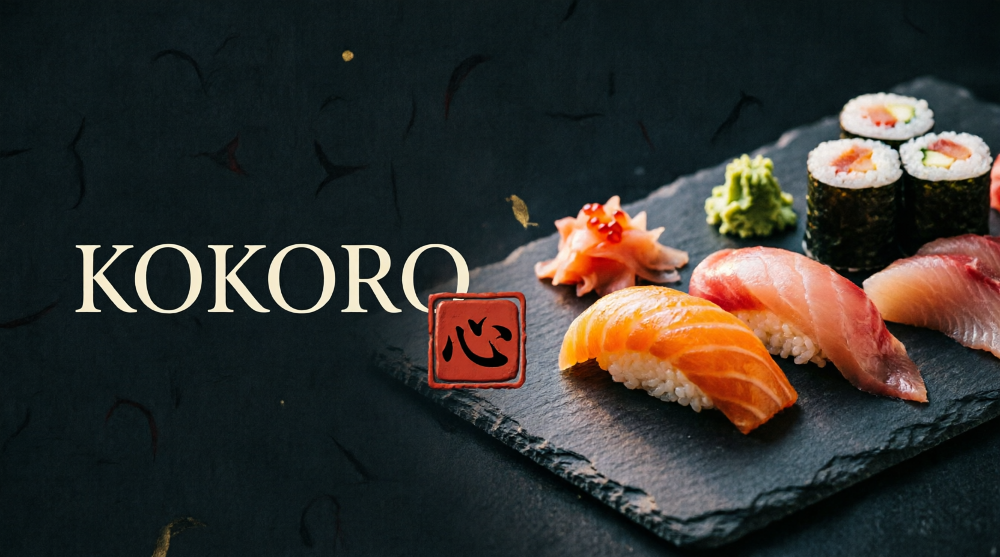

# Kokoro 心 · Cardápio Digital



Cardápio virtual para restaurante japonês com pedido online via WhatsApp.
Feito com **Vue 3**, **Vite** e **Tailwind CSS v4**.

## ✨ Funcionalidades

- 🍣 Cardápio com busca, categorias e filtros (mais pedidos, chef, picante, vegetariano)
- 🛒 Carrinho em drawer com quantidades, total e checkout formatado no WhatsApp
- 🍱 Modal de detalhes com seleção de quantidade por item
- 🎌 Seções de Omakase, rodízio, horários e localização
- 📱 Totalmente responsivo, com barra de pedido fixa no mobile
- 🎞️ Animações de scroll, marquee e micro-interações

## 🛠️ Stack

| Tecnologia | Uso |
|---|---|
| [Vue 3](https://vuejs.org/) | Composition API + `<script setup>` |
| [Vite](https://vite.dev/) | Build e dev server |
| [Tailwind CSS v4](https://tailwindcss.com/) | Estilização via `@theme` |

## ▶️ Como rodar

```bash
npm install
npm run dev      # desenvolvimento
npm run build    # build de produção (pasta dist/)
```

## 📁 Estrutura

```
src/
├── components/    # NavBar, Hero, MenuSection, CartDrawer, DetailModal…
├── composables/   # useStore.js — estado global do carrinho
├── data/          # menu.js — categorias e itens do cardápio
├── directives/    # reveal.js — animação de entrada ao rolar
├── utils.js       # moeda (BRL) e link do WhatsApp
└── style.css      # tokens de design (cores, fontes, animações)
```

## 🔧 Personalização

- **WhatsApp** → troque o número em `src/utils.js`
- **Cardápio** → edite itens, preços e fotos em `src/data/menu.js`
- **Tema** → cores, fontes e animações no `@theme` de `src/style.css`

> 💡 As fotos usam Unsplash com fallback automático: se alguma imagem falhar,
> o card exibe um tile com kanji no lugar — nada quebra.

## 📄 Licença

MIT — fique à vontade para usar e adaptar. いただきます! 🥢